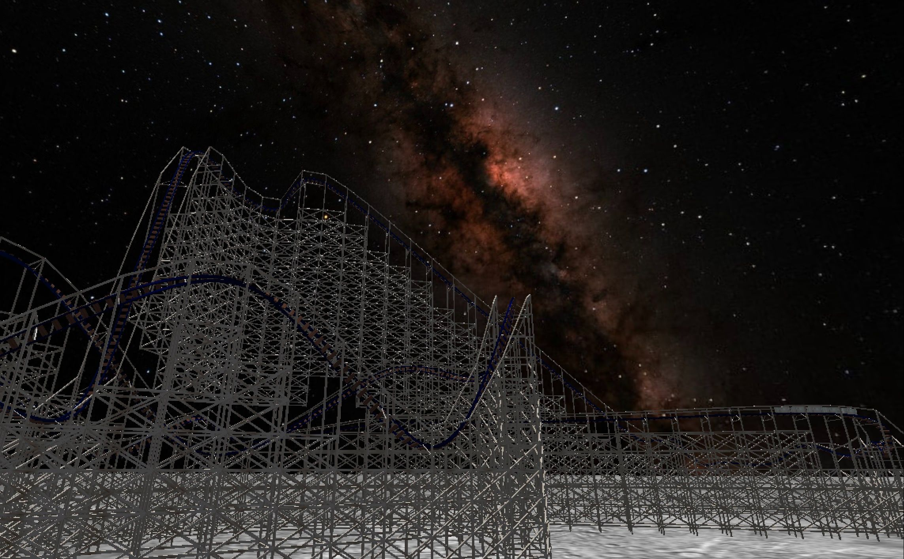
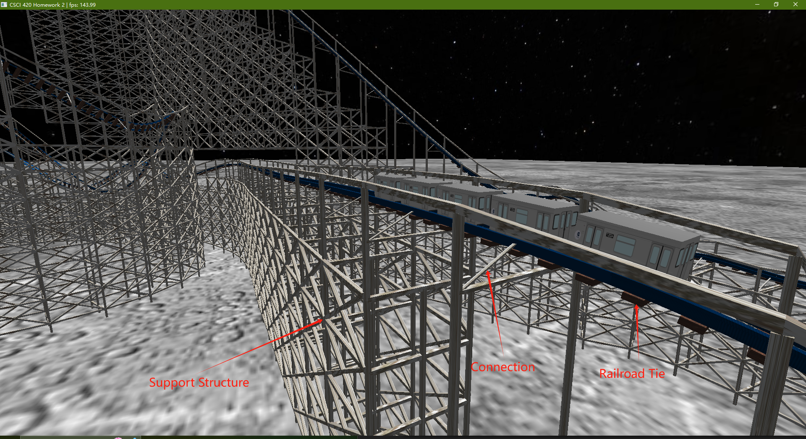
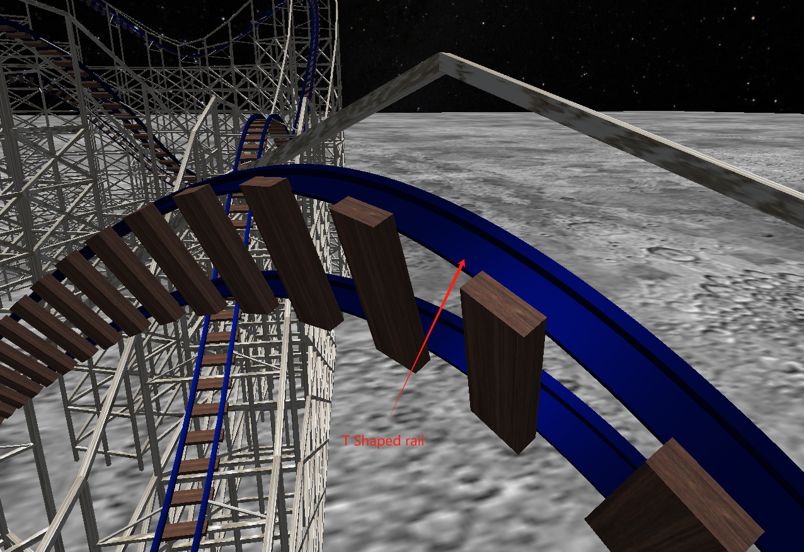
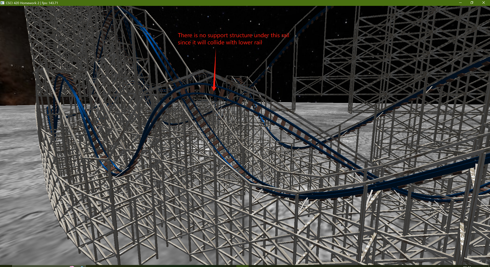

# Simulating a Roller Coaster

## Description
The project is to use Catmull-Rom splines along with OpenGL core profile shader-based texture mapping and Phong shading to create a roller coaster simulation.

## Features

	Double T-shaped rail

	Support wooden structure

	sky-box
	
 	Generate track from several sequences of splines

	Draw splines using recursive subdivision

	Modify velocity with which the camera moves

	Rendered roller coaster with texture

## Keyboard/Mouse controls

1. Move\stop the roller coaster: Press space '  ', initially the roller coaster are freezed unless press space ' ' to let it move.
2. Change the view type:
	'1'  : On the roller coaster. 
	'2  :  Look at the roller coaster. 
	'3' :  Free view.
3. Move in free view mode: 'w','a','s','d'.

## Results

Youtube link: https://www.youtube.com/shorts/_bupNbt5Yus

